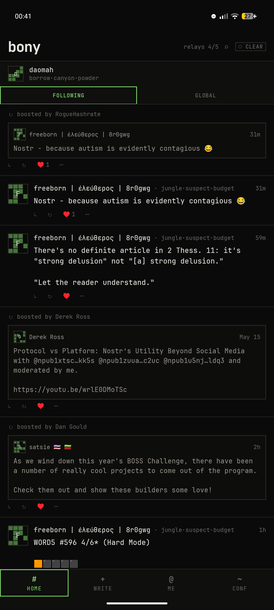
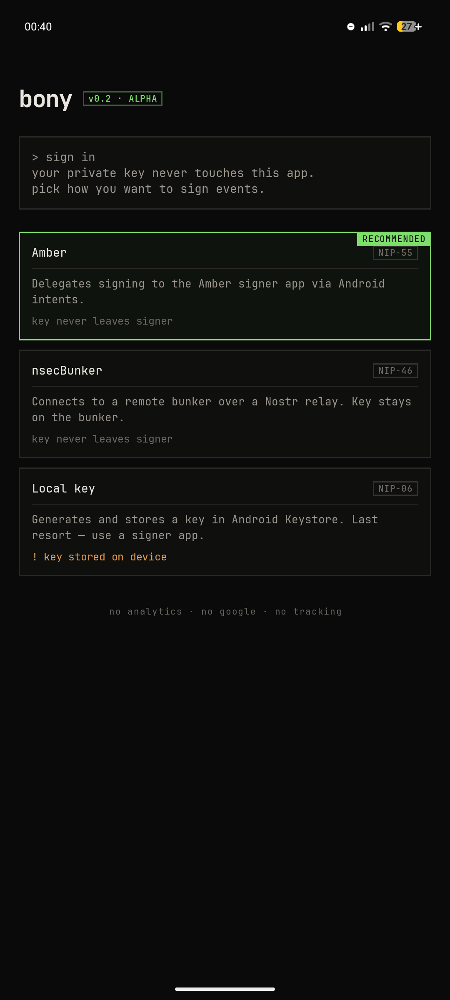
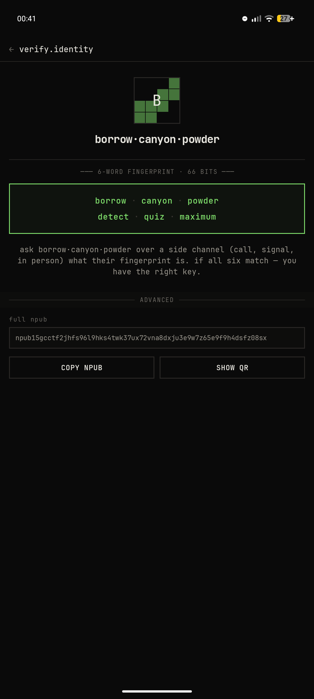
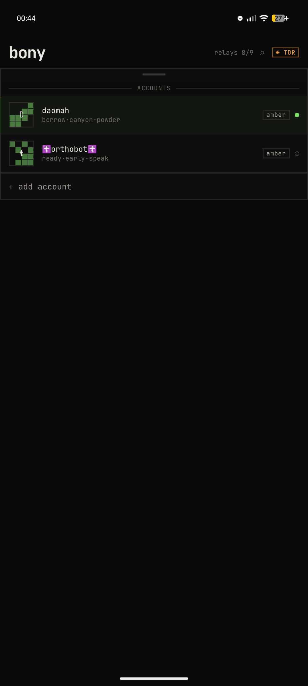
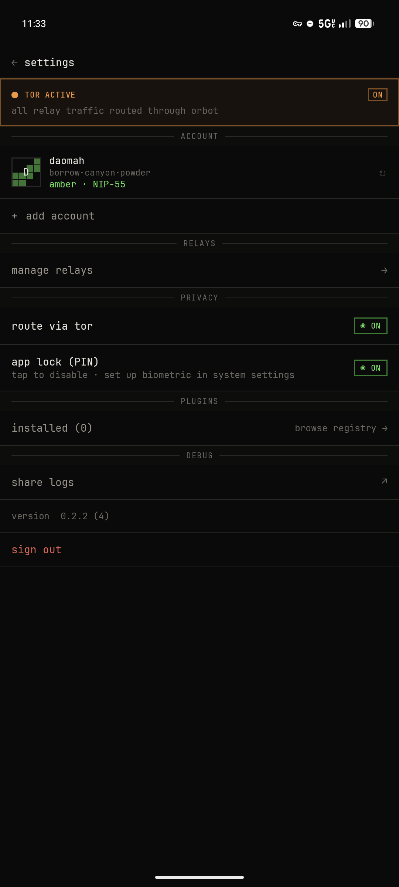

# 🦴 T-bone (privacy fork — `social.tbone.fork`)

> **This is a fork.** Upstream: [`5ToddSmith5/T-Bone-`](https://github.com/5ToddSmith5/T-Bone-) (release tag `Nostr`, v0.3.36).
> This fork installs **alongside** the original T-Bone as its own app (`social.tbone.fork`) — installing or updating one never touches the other.
> It is **100% privacy-focused, forever: no Google services, no tracking, ever** (enforced by CI — see [`docs/PRIVACY.md`](docs/PRIVACY.md)),
> and **fully open source (MIT)**. Releases are built automatically: push a `v*` tag and GitHub Actions publishes the APKs — see [`docs/RELEASE.md`](docs/RELEASE.md).
> Fork details: [`FORK.md`](FORK.md) · Contributing: [`CONTRIBUTING.md`](CONTRIBUTING.md) · Changelog: [`CHANGELOG.md`](CHANGELOG.md).

> One day someone is going to find all of these ostrich bones and make a T-Rex.

A bare-bones, Google-free, vibe-coded Nostr client for Android. Fast, lean, and extensible via plugins.

> **Fork** — T-bone is a community fork of [`daomah/bony`](https://codeberg.org/daomah/bony) (v0.2.5 → v0.3.0), installed as its own app (`social.tbone`) so it can live side-by-side with Bony. It keeps every upstream feature and the Google-free, privacy-first stance, and adds:
>
> - **Inline images, on by default** — settings → MEDIA → *inline images*: `ON` (auto-load in the feed at full quality, the default), `LOW` (auto-load at a lower resolution for speed), or `OFF` (tap-to-open placeholders). Image fetches still respect the Tor toggle.
> - **In-app image viewer** — tapping an image opens a full-screen viewer (never a browser) with pinch-to-zoom, drag to pan, double-tap to reset, a close button, and a download button that saves the original to `Pictures/T-bone` and confirms with a small popup. Downloads use the same Tor-aware connection as the feed.
> - **Notifications, full Wisp mechanism** — a bell tab (with an unread dot) opens the in-app notification center. An app-wide repository mirrors Wisp: reactions/reposts grouped per note with per-emoji actor lists, replies/quotes/mentions/follows, a 24h summary bar with tap-to-filter, a filter sheet with per-type switches (persisted), compact rows with real avatars + reaction emoji + relative timestamps, and rows that expand to show the note and offer an inline reply. **The last 24 hours are cached locally** (Room) so the tab opens instantly with real content — no endless spinner — and a **load older** button fetches history on demand from the relays. Ownership is verified so only reactions to *your* notes notify. In-app only — no push notifications, no accounts on notification services.
> - **Real avatars** — settings → AVATARS: *avatar style* `INITIAL` (letter squares) / `LOW` (real avatars, lower resolution) / `REGULAR` (real avatars at full quality), plus *animated avatars* on/off (off shows GIF avatars as a still picture).
> - **Themes + accent color** — Settings → APPEARANCE: **light / dark (pure black) / cream (warm old-book-page)** modes, plus an **accent color chooser** (a round hue/saturation wheel paired with a brightness bar) that replaces the default green everywhere the accent is used. Live preview while dragging, persisted on close.
> - **Faster names** — profiles for everyone you follow are prefetched as soon as your follow list arrives, so names appear with the feed instead of lagging behind.
> - **Thread fix** — opening a note in a thread now shows the full, untruncated note (the root and the note you tapped), instead of the shortened feed version.
> - **Encrypted Notes tab** — the bottom **NOTES** tab is a simple on-device scratchpad. Every note is **AES-256-GCM encrypted with a key in the Android Keystore**; only ciphertext is stored in the database, and the screen shows a lock badge only after an encrypt→decrypt round-trip passes.
> - **Signing indicator** — tapping like/reply/etc. with an external or remote signer now shows a deliberate "signing…" overlay the moment the request starts (Amber and nsecBunker both set it), so the handoff to the signer app no longer reads as an unexplained flash.
> - **New engagement buttons** — reply / like / quote / repost / share are now larger, recognizable icon buttons with counts; the like is an outline that fills **red** when you like, the reply button fills solid with its count when you've replied.
> - **Smaller polish** — long-press any relay address in relay settings to copy it; the home-feed account avatar follows your avatar settings; note lists reserve bottom space so the phone's action bar never covers replies/likes; tapping a reply in a thread always loads and shows the note it was replying to on top; the app lock shows only the lock screen (no flash of the previous screen); notifications no longer include follows; relay health dots always use fixed semantic colors; new black-and-white T-bone steak launcher icon.

---

<p align="center">
  
  
  
  
  
</p>

---

## 🧘 Philosophy

Do the minimum well. No analytics, no tracking, no Google Services. Authentication is always delegated to an external signer — the app never touches your private key. Features you don't want don't ship with the app; they're plugins you install by choice.

---

## ⚡ Core Features

- **Multi-account** — add, switch, and remove accounts from within the app; account switcher sheet with signer-type pill per account
- **External signers** — [Amber](https://github.com/greenart7c3/Amber) (NIP-55) and nsecBunker (NIP-46); Android Keystore as a local fallback
- **Phrase fingerprint identity** — replaces truncated hex npubs throughout the UI with human-readable BIP-39 words derived from the pubkey: 3-word handle in feed rows, 6-word fingerprint on profiles, full npub + QR on the Verify Identity screen (see [Identity Convention](docs/identity-convention.md))
- **Deterministic dot avatars** — 4×4 grid derived from the pubkey hash; square, never circular
- **Home feed** — follow-graph events with live relay streaming, pull-to-refresh, and atomic load (feed appears all at once, not one note at a time)
- **Global feed** — all kind-1 notes from connected relays; switchable via the FOLLOWING / GLOBAL tab strip at the top of the home screen
- **Reposts and quote-notes** — kind-6 reposts rendered as embedded cards; quote-notes (NIP-18 `q` tag and inline `nostr:note1…` refs) resolved and embedded
- **Inline media** — images auto-load in the feed (off / on / low-quality setting, on by default) and open in a full-screen viewer with pinch-zoom and download; videos open in the system viewer
- **Notifications tab** — full Wisp-style in-app bell tab: 24h summary with tap-to-filter, filter sheet with persisted type switches, grouped compact rows, expandable note previews with inline reply, an unread dot, and follows
- **Avatars** — real profile pictures in the feed, threads, notifications and profiles with INITIAL / LOW / REGULAR modes and a still-vs-animated GIF toggle (Settings → AVATARS)
- **Thread view** — root note → gap indicator → direct parent → focused note → live replies header with count; the note you opened and the thread root render in full
- **Compose** — new notes, replies (NIP-10 `e`/`p` tags with root/reply markers), and quote-notes (`q` tag + inline ref)
- **Boost notes** — one-tap repost (kind-6) via your active signer
- **Reactions** — NIP-25 like button with count; optimistic update with rollback on failure; heart fills and locks once reacted
- **Follow / unfollow** — follow or unfollow any profile; publishes updated kind-3 contact list and persists locally
- **Share notes** — Android share sheet with note text + `nostr:note1…` URI
- **Share profiles** — share `nostr:npub1…` URI + display name via Android share sheet
- **@mention resolution** — `nostr:npub1…` and `nostr:nprofile1…` refs in note text resolved to display names from the profile cache
- **Profile pages** — banner image, 6-word fingerprint pill (tap → Verify Identity screen), NIP-05 badge, bio, NOTES/REPLIES/MEDIA tabs, follow/unfollow and share buttons
- **Verify Identity screen** — 6-word fingerprint in a prominent accent box with instructions for out-of-band verification; full npub code block with copy button
- **Relay management** — Tor/relay pill in the feed top bar (`◉ TOR` in amber when active, `○ CLEAR` otherwise); add/remove relays with status dots; changes persisted to your account
- **Relay AUTH** — automatic NIP-42 authentication for relays that require it (nos.lol, paid relays)
- **Tor support** — route all relay traffic and image fetches through [Orbot](https://github.com/guardianproject/orbot); prefers the HTTP CONNECT proxy (port 8118, no DNS leak) over SOCKS; toggle in Settings
- **Log export** — Settings → Share logs for bug reports

---

## 🛠️ Tech Stack

| Concern | Choice |
|---|---|
| Language | Kotlin |
| UI | Jetpack Compose (custom Bony design system — no M3 chrome) |
| Font | JetBrains Mono NL (bundled, OFL license) |
| WebSocket | OkHttp |
| Database | Room (SQLite) — events persisted across restarts |
| Crypto | Bouncy Castle / tink (secp256k1) |
| DI | Hilt |
| Preferences | DataStore |
| Min SDK | API 26 (Android 8.0) |

No Firebase. No Google Play Services.

---

## 📡 NIP Compatibility

Bony supports the core Nostr protocol out of the box. Extended features are handled through plugins rather than bundled into the app. See the full [NIP compatibility table](docs/nip-compatibility.md).

---

## 🧩 Plugin System

Extended functionality is delivered via plugins — separate APKs that bind to the app over AIDL. Plugins never receive private keys; publishing is always proxied through the app's signer. See [plugin system docs](docs/plugin-system.md).

---

## 🚀 Getting Started

### Install

T-bone installs as its own app (`social.tbone`), so it can be installed alongside the original Bony. Grab the APK from the releases page and sideload it — no Google Play required.

### Build from source

Clone the repo and open in Android Studio — the Gradle wrapper handles dependencies automatically. Min SDK: API 26 (Android 8.0).

```bash
./gradlew assembleDebug
# Output: app/build/outputs/apk/debug/app-debug.apk
```

---

## 📁 Repository Layout

```
bony/
├── app/
│   └── src/main/
│       ├── assets/
│       │   └── bip39_english.txt       # BIP-39 English wordlist (2048 words) for phrase fingerprints
│       ├── kotlin/social/tbone/
│       │   ├── BonyApp.kt              # Hilt application entry point; calls Phrase.init()
│       │   ├── MainActivity.kt
│       │   ├── nostr/
│       │   │   ├── identity/
│       │   │   │   └── Phrase.kt       # BIP-39 phrase derivation from pubkey hash
│       │   │   ├── Event.kt            # NIP-01 event model + UnsignedEvent
│       │   │   ├── EventKind.kt        # Known event kind constants
│       │   │   ├── Tag.kt              # Tag wrapper + NIP-10/18 helpers
│       │   │   ├── Filter.kt           # Subscription filters
│       │   │   ├── Nip19.kt            # bech32 encode/decode (npub, note, nevent, nprofile TLV)
│       │   │   └── Crypto.kt           # BIP-340 Schnorr verification
│       │   ├── account/
│       │   │   ├── signer/             # NostrSigner, AmberSigner, LocalKeySigner, NsecBunkerSigner
│       │   │   └── AccountRepository.kt
│       │   ├── db/                     # Room DB: events, profiles
│       │   ├── profile/                # ProfileRepository, ProfileContent
│       │   ├── reactions/              # ReactionsRepository (NIP-25 kind-7, optimistic updates)
│       │   ├── settings/               # AppSettings (DataStore), OrbotHelper, Tor transport
│       │   └── ui/
│       │       ├── BonyNavHost.kt
│       │       ├── feed/               # FeedScreen, FeedViewModel, NoteCard, NoteContent
│       │       ├── thread/             # ThreadScreen, ThreadViewModel
│       │       ├── compose/            # ComposeScreen, ComposeViewModel (new note / reply / quote)
│       │       ├── profile/            # ProfileScreen, ProfileViewModel, VerifyIdentityScreen/VM
│       │       ├── settings/           # SettingsScreen, AccountManagement, RelayManagement
│       │       ├── onboarding/         # OnboardingScreen, OnboardingViewModel
│       │       ├── components/         # AccountSwitcherSheet, DotAvatar, IdentityRow, SectionHeader
│       │       └── theme/              # BonyTheme, BonyColors, BonyType, JetBrainsMono
│       └── res/
│           └── font/                   # JetBrains Mono NL (Regular, SemiBold, Bold — OFL license)
└── docs/
```

---

## 🔏 Verifying Downloads

Release APKs are signed by the fork maintainer; verify the signature matches the identity you downloaded from. You can verify any APK manually:

```bash
# Requires apksigner from Android SDK build-tools, or use apkeep / androguard
apksigner verify --print-certs app-release.apk
```

Expected certificate SHA-256 fingerprint:

```
c7e7df1b274e66632d39b8f98b1a48bb72d20095ff018f4cb198efc5dc8d0580
```

If the fingerprint does not match, do not install the APK.

---

## 🐛 Reporting Issues

Bony includes built-in log export to make bug reports useful:

1. Reproduce the issue
2. Open **Settings** (`~` tab in the bottom bar)
3. Tap **Share logs** and send the log file with your issue report

Logs are written to the app's private storage (`filesDir/logs/bony.log`), rotate at 2 MB, and never leave the device unless you explicitly share them.

---

## 🗺️ Roadmap

### Near-term

- **Notifications** — UnifiedPush native integration via [Pokey](https://github.com/KoalaSat/pokey): Bony registers with Pokey as a UnifiedPush client; Pokey watches relays and delivers payloads; Bony displays system notifications and deep-links into the relevant thread on tap
- NIP-05 verification badges on profiles
- NIP-09 event deletion
- Hashtag feeds — plugin candidate
- Web of trust — deferred until spam is a real problem; 2-hop local filter (kind-3 already cached) is the planned core implementation; external WoT scoring (e.g. wot.nostr.band style) is a plugin

### Deferred / companion apps

- **DMs** — [0xchat](https://0xchat.com) supports NIP-04 and NIP-17 private DMs; Bony may eventually offer a basic DM plugin

### Known limitations

- nsecBunker (NIP-46) onboarding has not been tested end-to-end against a real bunker.
- NIP-42 relay AUTH is skipped for Amber accounts (signing requires UI interaction per challenge).
- Feed scroll position may not reset correctly on account switch in all edge cases.

---

## 🤝 Contributing

Plugins extend Bony. Core PRs should keep the app lean — if a feature can be a plugin, it should be.

---

## 📄 License

MIT
